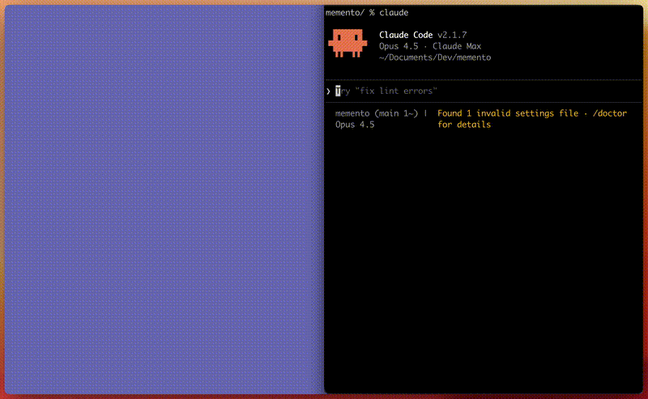

# claude-speed-reader

Speed read Claude's responses at 600+ WPM using RSVP with Spritz-style ORP highlighting.



## What is this?

A Claude Code skill that lets you speed-read any response. Uses **Rapid Serial Visual Presentation (RSVP)** — displaying one word at a time with the **Optimal Recognition Point (ORP)** highlighted in red. Your eyes stay fixed while your brain processes text at 2-3x normal reading speed.

## Install

```bash
# Clone to your Claude skills directory
git clone https://github.com/SeanZoR/claude-speed-reader.git ~/.claude/skills/speed
```

Or manually copy the `.claude/` folder contents to your `~/.claude/` directory.

## Usage

In Claude Code, after any response:

```
/speed
```

That's it. Opens a minimal dark reader with the last response loaded.

**Custom text:**
```
/speed "Your text here"
```

## Controls

| Key | Action |
|-----|--------|
| `Space` | Play / Pause |
| `←` `→` | Adjust speed (±50 WPM) |
| `R` | Restart |
| `V` | Paste new text |

Click anywhere to toggle play/pause. Drag & drop text files supported.

## How ORP Works

The red highlighted letter is the **Optimal Recognition Point** — positioned ~1/3 into each word where your brain naturally focuses. By keeping this point fixed on screen, you eliminate eye movement (saccades) that consume 80% of reading time.

```
    th[e] quick br[o]wn fox ju[m]ps
       ↑         ↑         ↑
      ORP       ORP       ORP
```

## Customization

Edit `~/.claude/skills/speed/data/reader.html` to customize:
- Default WPM (currently 600)
- Colors and fonts
- Timing multipliers for punctuation

## Requirements

- Claude Code
- macOS (uses `open` command)

## License

MIT

---

Built for humans who want to read Claude's novels faster.
