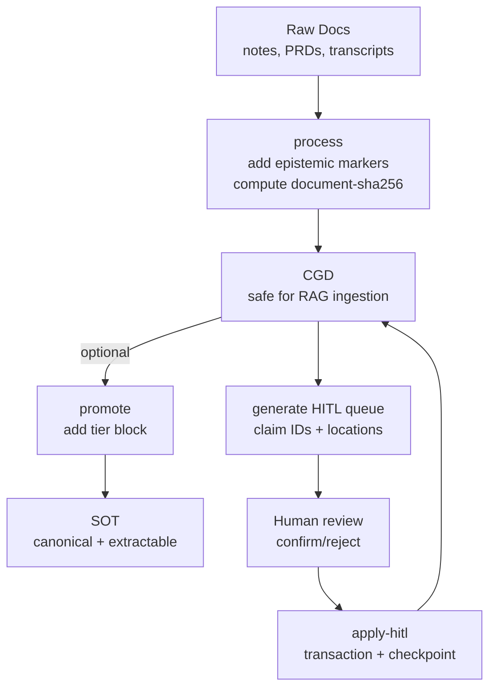
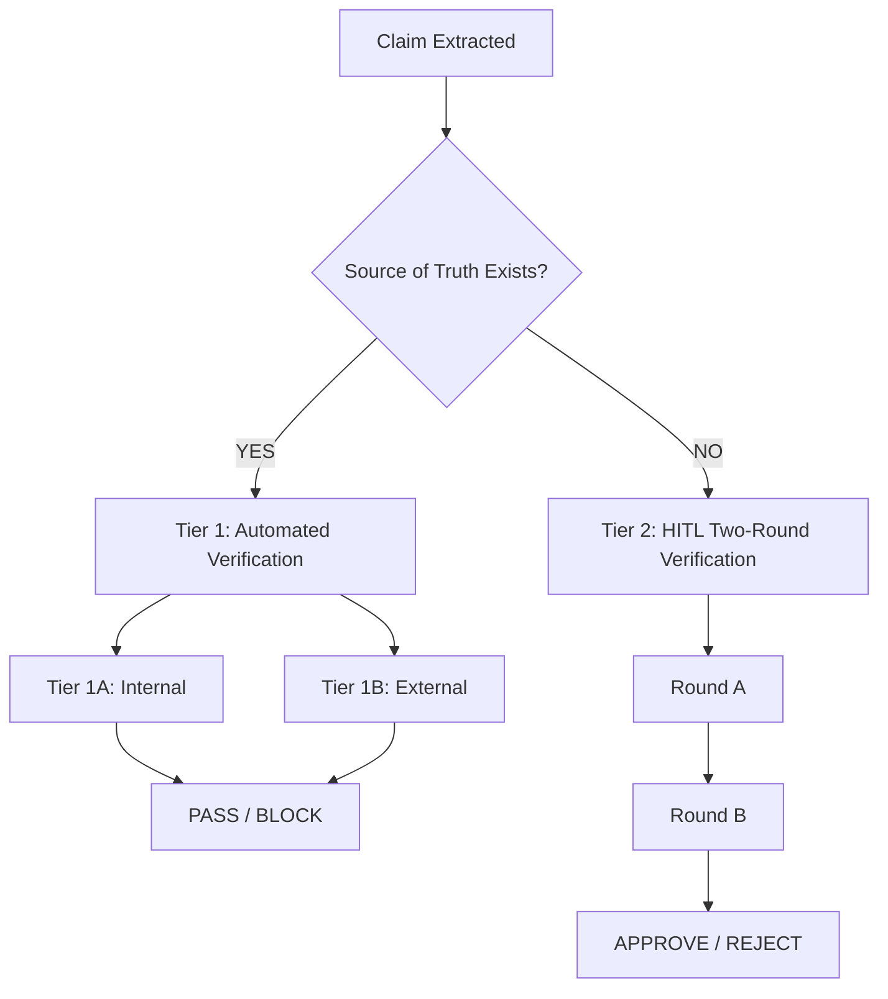

# Clarity Gate — Prevent LLMs from Misinterpreting Facts

> **⚠️ LATEST:** Version 2.1 released (2026-01-27). RFC-001 applied: claim status semantics, bundled scripts. See [CHANGELOG](CHANGELOG.md).

> ✅ **This README passed Clarity Gate verification** (2026-01-13, adversarial mode, Claude Opus 4.5)

**Open-source pre-ingestion verification for epistemic quality in RAG systems.**

[](https://creativecommons.org/licenses/by/4.0/)

> *"Detection finds what is; enforcement ensures what should be. In practice: find the missing uncertainty markers before they become confident hallucinations."*

---

## The Problem

If you feed a well-aligned model a document that states "Revenue will reach $50M by Q4" as fact (when it's actually a projection), the model will confidently report this as fact.

The model isn't hallucinating. It's faithfully representing what it was told.

**The failure happened before the model saw the input.**

| Document Says | Accuracy Check | Epistemic Check |
|---------------|----------------|-----------------|
| "Revenue will be $50M" (unmarked projection) | ✅ PASS | ❌ FAIL — projection stated as fact |
| "Our approach outperforms X" (no evidence) | ✅ PASS | ❌ FAIL — ungrounded assertion |
| "Users prefer feature Y" (no methodology) | ✅ PASS | ❌ FAIL — missing epistemic basis |

**Accuracy verification asks:** "Does this match the source?"  
**Epistemic verification asks:** "Is this claim properly qualified?"

Both matter. Accuracy verification has mature open-source tools. Epistemic verification has detection systems (UnScientify, HedgeHunter, BioScope), but at the date of 2.0 release (January 13th, 2026), I found no open-source pre-ingestion epistemic enforcement system (methodology: deep research conducted via multiple LLMs). Corrections welcome.

Clarity Gate is a proposal for that layer.

---

## What Is Clarity Gate?

Clarity Gate is an **open-source pre-ingestion verification system** for epistemic quality.

- **Clarity** — Making explicit what's fact, what's projection, what's hypothesis
- **Gate** — Documents don't enter the knowledge base until they pass verification

### The Gap It Addresses

| Component | Status |
|-----------|--------|
| Pre-ingestion gate pattern | ✅ Proven (Adlib, pharma QMS) |
| Epistemic detection | ✅ Proven (UnScientify, HedgeHunter) |
| **Pre-ingestion epistemic enforcement** | ❌ Gap (to my knowledge) |
| **Open-source accessibility** | ❌ Gap |

| Dimension | Enterprise (Adlib) | Clarity Gate |
|-----------|-------------------|--------------|
| **License** | Proprietary | Open source (CC BY 4.0) |
| **Focus** | Accuracy, compliance | Epistemic quality |
| **Target** | Fortune 500 | Founders, researchers, small teams |
| **Cost** | Enterprise pricing | Free |

---

## When to Use Clarity Gate

Most valuable when:

- Your RAG corpus includes **drafts, docs, tickets, meeting notes**, or user-provided content
- You care about **correctness** and want a verifiable ingestion gate
- You need a practical **HITL loop** that scales beyond manual spot checks
- You want **automated enforcement** of document quality before ingestion

---

## How Clarity Gate Differs from Knowledge Engineering Tools

| Aspect | Semantica / LlamaIndex | Clarity Gate |
|--------|------------------------|--------------|
| **Stage** | Post-extraction | Pre-ingestion |
| **Input** | Structured entities | Raw documents |
| **Problem** | "Which value is correct?" | "Is this claim properly qualified?" |
| **Output** | Resolved knowledge graph | Annotated document (CGD) |
| **Conflict** | Multi-source disagreement | Unmarked projections/assumptions |

**They're complementary:** Use Clarity Gate *before* Semantica/LlamaIndex.

---

## Quick Start

### Option 1: Claude.ai (Web) — Skill Upload

1. Download [`dist/clarity-gate.skill`](dist/clarity-gate.skill)
2. Go to claude.ai → Settings → Features → Skills → Upload
3. Upload the `.skill` file
4. Ask Claude: *"Run clarity gate on this document"*

### Option 2: Claude Desktop

Same as Option 1 — Claude Desktop uses the same skill format as claude.ai.

### Option 3: Claude Code

Clone the repo — Claude Code auto-detects skills in `.claude/skills/`:

```bash
git clone https://github.com/frmoretto/clarity-gate
cd clarity-gate
# Claude Code will automatically detect .claude/skills/clarity-gate/SKILL.md
```

Or copy `.claude/skills/clarity-gate/` to your project's `.claude/skills/` directory.

Ask Claude: *"Run clarity gate on this document"*

### Option 4: Claude Projects

Add [`skills/clarity-gate/SKILL.md`](skills/clarity-gate/SKILL.md) to project knowledge. Claude will search it when needed, though Skills provide better integration.

### Option 5: OpenAI Codex / GitHub Copilot

Copy the canonical skill to the appropriate directory:

| Platform | Location |
|----------|----------|
| OpenAI Codex | `.codex/skills/clarity-gate/SKILL.md` |
| GitHub Copilot | `.github/skills/clarity-gate/SKILL.md` |

Use [`skills/clarity-gate/SKILL.md`](skills/clarity-gate/SKILL.md) (agentskills.io format).

### Option 6: Manual / Other LLMs

Use the [9-point verification](docs/ARCHITECTURE.md#the-9-verification-points) as a manual review process.

For Cursor, Windsurf, or other AI tools, extract the 9 verification points into your `.cursorrules`. The methodology is tool-agnostic—only SKILL.md is Claude-optimized.

---

## Platform-Specific Skill Locations

| Platform | Skill Location | Frontmatter Format |
|----------|----------------|-------------------|
| Claude.ai / Claude Desktop | `.claude/skills/clarity-gate/` | Minimal (`name`, `description` only) |
| Claude Code | `.claude/skills/clarity-gate/` | Minimal |
| OpenAI Codex | `.codex/skills/clarity-gate/` | agentskills.io (full) |
| GitHub Copilot | `.github/skills/clarity-gate/` | agentskills.io (full) |
| Canonical | `skills/clarity-gate/` | agentskills.io (full) |

Pre-built skill file: [`dist/clarity-gate.skill`](dist/clarity-gate.skill)

---

## Format Specification

See [CLARITY_GATE_FORMAT_SPEC.md](docs/CLARITY_GATE_FORMAT_SPEC.md) for the complete format specification (v2.0).

---

## Two Modes

**Verify Mode (default):**
```
"Run clarity gate on this document"
→ Issues report + Two-Round HITL verification
```

**Annotate Mode:**
```
"Run clarity gate and annotate this document"
→ Complete document with fixes applied inline (CGD)
```

The annotated output is a **Clarity-Gated Document (CGD)**.

---

## Workflow Overview



---

## The 9 Verification Points

### Epistemic Checks (Core Focus)

1. **Hypothesis vs. Fact Labeling** — Claims marked as validated or hypothetical
2. **Uncertainty Marker Enforcement** — Forward-looking statements require qualifiers
3. **Assumption Visibility** — Implicit assumptions made explicit
4. **Authoritative-Looking Unvalidated Data** — Tables with percentages flagged if unvalidated

### Data Quality Checks (Complementary)

5. **Data Consistency** — Conflicting numbers within document
6. **Implicit Causation** — Claims implying causation without evidence
7. **Future State as Present** — Planned outcomes described as achieved

### Verification Routing

8. **Temporal Coherence** — Dates consistent with each other and with present
9. **Externally Verifiable Claims** — Pricing, statistics, competitor claims flagged for verification

See [ARCHITECTURE.md](docs/ARCHITECTURE.md) for full details and examples.

---

## Two-Round HITL Verification

Different claims need different types of verification:

| Claim Type | What Human Checks | Cognitive Load |
|------------|-------------------|----------------|
| LLM found source, human witnessed | "Did I interpret correctly?" | Low (quick scan) |
| Human's own data | "Is this actually true?" | High (real verification) |
| No source found | "Is this actually true?" | High (real verification) |

**The system separates these into two rounds:**

### Round A: Derived Data Confirmation

Quick scan of claims from sources found in the current session:

```
## Derived Data Confirmation

These claims came from sources found in this session:

- [Specific claim from source A] (source link)
- [Specific claim from source B] (source link)

Reply "confirmed" or flag any I misread.
```

### Round B: True HITL Verification

Full verification of claims needing actual checking:

```
## HITL Verification Required

| # | Claim | Why HITL Needed | Human Confirms |
|---|-------|-----------------|----------------|
| 1 | Benchmark scores (100%, 75%→100%) | Your experiment data | [ ] True / [ ] False |
```

**Result:** Human attention focused on claims that actually need it.

---

## Verification Hierarchy



### Tier 1A: Internal Consistency (Ready Now)

Checks for contradictions *within* a document — no external systems required.

| Check Type | Example |
|------------|---------|
| Figure vs. Text | Figure shows β=0.33, text claims β=0.73 |
| Abstract vs. Body | Abstract claims "40% improvement," body shows 28% |
| Table vs. Prose | Table lists 5 features, text references 7 |

See [biology paper example](examples/biology-paper-example.md) for a real case where Clarity Gate detected a Δ=0.40 discrepancy. Try it yourself at [arxiparse.org](https://arxiparse.org).

### Tier 1B: External Verification (Extension Interface)

For claims verifiable against structured sources. **Users provide connectors.**

### Tier 2: Two-Round HITL (Intelligent Routing)

The system detects *which* specific claims need human review AND *what kind of review* each needs.

*Example: Most claims in a document typically pass automated checks, with the remainder split between Round A (quick confirmation) and Round B (real verification). (Illustrative — actual ratios vary by document type.)*

---

## Where This Fits

```
Layer 4: Human Strategic Oversight
Layer 3: AI Behavior Verification (behavioral evals, red-teaming)
Layer 2: Input/Context Verification  <-- Clarity Gate
Layer 1: Deterministic Boundaries (rate limits, guardrails)
Layer 0: AI Execution
```

A perfectly aligned model (Layer 3) can confidently produce unsafe outputs from unsafe context (Layer 2). Alignment doesn't inoculate against misleading information.

---

## Prior Art

Clarity Gate builds on proven patterns. See [PRIOR_ART.md](docs/PRIOR_ART.md) for the full landscape.

**Enterprise Gates:** Adlib Software, Pharmaceutical QMS  
**Epistemic Detection:** UnScientify, HedgeHunter, FactBank  
**Fact-Checking:** FEVER, ClaimBuster  
**Post-Retrieval:** Self-RAG, RAGAS, TruLens

**The opportunity:** Existing detection tools (UnScientify, HedgeHunter, BioScope) excel at identifying uncertainty markers. Clarity Gate proposes a complementary enforcement layer that routes ambiguous claims to human review or marks them automatically. I believe these could work together. Community input on integration is welcome.

---

## Critical Limitation

> **Clarity Gate verifies FORM, not TRUTH.**

This system checks whether claims are properly marked as uncertain — it cannot verify if claims are actually true.

**Risk:** An LLM can hallucinate facts INTO a document, then "pass" Clarity Gate by adding source markers to false claims.

**Mitigation:** Two-Round HITL verification is **mandatory** before declaring PASS. See [SKILL.md](skills/clarity-gate/SKILL.md) for the full protocol.

---

## Non-Goals (By Design)

- Does **not** prove truth automatically — enforces correct labeling and verification workflow
- Does **not** replace source citations — prevents epistemic category errors
- Does **not** require a centralized database — file-first and Git-friendly

---

## Roadmap

| Phase | Status | Description |
|-------|--------|-------------|
| **Phase 1** | ✅ Ready | Internal consistency checks + Two-Round HITL + annotation (Claude skill) |
| **Phase 2** | 🔜 Planned | npm/PyPI validators for CI/CD integration |
| **Phase 3** | 🔜 Planned | External verification hooks (user connectors) |
| **Phase 4** | 🔜 Planned | Confidence scoring for HITL optimization |

See [ROADMAP.md](docs/ROADMAP.md) for details.

---

## Documentation

| Document | Description |
|----------|-------------|
| [CLARITY_GATE_FORMAT_SPEC.md](docs/CLARITY_GATE_FORMAT_SPEC.md) | Unified format specification (v2.0) |
| [CLARITY_GATE_PROCEDURES.md](docs/CLARITY_GATE_PROCEDURES.md) | Verification procedures and workflows |
| [ARCHITECTURE.md](docs/ARCHITECTURE.md) | Full 9-point system, verification hierarchy |
| [PRIOR_ART.md](docs/PRIOR_ART.md) | Landscape of existing systems |
| [ROADMAP.md](docs/ROADMAP.md) | Phase 1/2/3 development plan |
| [BENCHMARK_RESULTS.md](docs/research/BENCHMARK_RESULTS.md) | Empirical validation (+19-25% improvement for mid-tier models) |
| [SKILL.md](skills/clarity-gate/SKILL.md) | Claude skill implementation (v2.0) |
| [examples/](examples/) | Real-world verification examples |

---

## Related

**arxiparse.org** — Live implementation for scientific papers  
[arxiparse.org](https://arxiparse.org)

**Source of Truth Creator** — Create epistemically calibrated documents (use before verification)  
[github.com/frmoretto/source-of-truth-creator](https://github.com/frmoretto/source-of-truth-creator)

**Stream Coding** — Documentation-first methodology where Clarity Gate originated  
[github.com/frmoretto/stream-coding](https://github.com/frmoretto/stream-coding)

---

## License

CC BY 4.0 — Use freely with attribution.

---

## Author

**Francesco Marinoni Moretto**
- GitHub: [@frmoretto](https://github.com/frmoretto)
- LinkedIn: [francesco-moretto](https://www.linkedin.com/in/francesco-moretto/)

---

## Contributing

Looking for:

1. **Prior art** — Open-source pre-ingestion gates for epistemic quality I missed?
2. **Integration** — LlamaIndex, LangChain implementations
3. **Verification feedback** — Are the 9 points the right focus?
4. **Real-world examples** — Documents that expose edge cases

Open an issue or PR.
